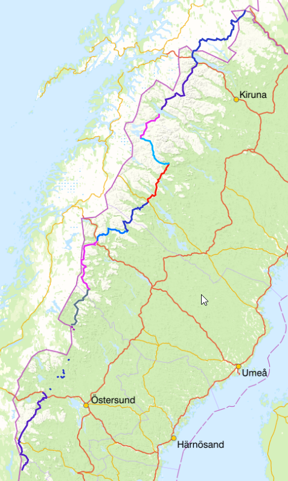

# Gröna Bandet Plan

[https://www.vitagronabandet.se/sv-SE](https://www.vitagronabandet.se/sv-SE)

| Etapp                                                        | Mil       | Höjdskillnad | Dagar   | Proviantering                                                | Kml                                              | Gpx                                              |
| ------------------------------------------------------------ | --------- | ------------ | ------- | ------------------------------------------------------------ | ------------------------------------------------ | ------------------------------------------------ |
| Grövelsjön                                                   |           |              |         |                                                              |                                                  |                                                  |
| [Hamra](https://www.gaiagps.com/map/?loc=8.7/12.0413/62.3384&pubLink=wFQMgLunSAAnA75nwHCRLRhJ&trackId=566247c5-e825-4c16-a37d-b71c3cdf6c65) | 8         | 3 426        | 3       | [Hamra Livs](https://www.tanndalen.com/utforska/hamra-livs/) Mån-Sön 09-19  070-241 11 84 | [kml](./kmls/etapp-1-grovelsjon-hamra.kml)       | [gpx](./gpxs/etapp-1-grovelsjon-hamra.gpx)       |
| [Åre](https://www.gaiagps.com/map/?loc=8.7/12.4826/62.3487&pubLink=BGfs8nMcgFnxVDENe9c68IqE&trackId=70fd4db8-a2e7-4dfe-b550-d915210fca60) | 15        | 6 151        | 6       | Flera möjligheter                                            | [kml](./kmls/etapp-2-hamra-are.kml)              | [gpx](./gpxs/etapp-2-hamra-are.gpx)              |
| [Rötviken](https://www.gaiagps.com/map/?loc=8.3/13.2318/63.6800&pubLink=4Oi1wUXK9juDXVCOe9nSwcJY&trackId=99237973-961f-4c9a-b5d9-7f488256a3f3) | 13        | 3 827        | 4       | [Servicepunkt Handlarn](https://www.handlarn.se/butiker--oppettider/rotviken-follinge) Mån-Tor 10-18, Fre 10-19, Lör 10-14 0645-770900 | [kml](./kmls/etapp-3-are-rotviken.kml)           | [gpx](./gpxs/etapp-3-are-rotviken.gpx)           |
| [Gäddede](https://www.gaiagps.com/map/?loc=8.3/13.2318/63.6800&pubLink=wyw7Mim5o20Dt0EHgb04YTQc&trackId=1520f385-04fc-4408-944f-07bd31d471e0) | 9         | 2 604        | 3       | [Ica Gränsbua](https://www.ica.se/butiker/nara/stromsund/gransbua-504/start/) Mån-Fre 10-18, Lör 10-16 0672-10024 | [kml](./kmls/etapp-4-rotviken-gaddede.kml)       | [gpx](./gpxs/etapp-4-rotviken-gaddede.gpx)       |
| [Klimpfjäll](https://www.gaiagps.com/map/?loc=8.3/14.0761/64.7793&pubLink=nIIXRK1ySiRQZ9Y7miuqA8GB&trackId=bf9d9234-aae2-487c-83d4-9822114cd34f) | 10        | 3 258        | 3       | [Handlarn Klimpfjäll](https://www.handlarn.se/butiker--oppettider/klimpfjall) Mån 9:30-18, Tis 11:30-18, Ons: 9:30-18 ,Tor: 11:30-18, Fre: 9:30-18, Lör: 10-15 0940-71090 | [kml](./kmls/etapp-5-gaddede-klimpfjall.kml)     | [gpx](./gpxs/etapp-5-gaddede-klimpfjall.gpx)     |
| [Hemavan](https://www.gaiagps.com/map/?loc=8.3/14.0761/64.7793&pubLink=flSSKvlb4X18tIC3o5YgGQvr&trackId=17e73152-cd57-4f9d-b48b-1d23a5190d5c) | 13        | 4 440        | 5       | [Ica Fjällboden](https://www.ica.se/butiker/nara/storuman/fjallboden-hemavan-253/start/) Mån-Lör: 9-19Sön: 10-19 0954-30003 | [kml](./kmls/etapp-6-klimpfjall-hemavan.kml)     | [gpx](./gpxs/etapp-6-klimpfjall-hemavan.gpx)     |
| [Ammarnäs](https://www.gaiagps.com/map/?loc=8.3/14.0761/64.7793&pubLink=flSSKvlb4X18tIC3o5YgGQvr&trackId=17e73152-cd57-4f9d-b48b-1d23a5190d5c) | 8         | 3 966        | 3       | [Ammarnäs Livs](https://ammarnaslivs.se/) https://ammarnaslivs.se/ Mån-Tor 10-18, Fre 10-20, Lör 09-15, Sön 11-16 0952-60007 | [kml](./kmls/etapp-7-hemavan-ammarnas.kml)       | [gpx](./gpxs/etapp-7-hemavan-ammarnas.gpx)       |
| [Jäkkvik](https://www.gaiagps.com/map/?loc=9.6/15.4938/65.9030&pubLink=zmfHAA8aNzDtcsSPEvyHHK7e&trackId=791e5ec2-0f7b-43df-ae29-e8ae1ee20860) | 9         | 2 960        | 3       | [Ica Nära Jäckvik](https://www.ica.se/butiker/nara/arjeplog/ica-nara-jackvik-16752/start/?gclid=Cj0KCQjwutaCBhDfARIsAJHWnHvEs-5nZIhkWXebcMYjvtWMpaNxTR6g-avghFmOo3FGDvEiVkPf8W8aAmy-EALw_wcB) Mån-Sön 11-18 0961-21050 | [kml](./kmls/etapp-8-ammarnas-jakkvik.kml)       | [gpx](./gpxs/etapp-8-ammarnas-jakkvik.gpx)       |
| [Kvikjokk](https://www.gaiagps.com/map/?loc=8.2/16.9162/66.6674&pubLink=KZjcxScWiidMF5DzkFLXp2d6&trackId=f5be3050-d79e-4fe0-8d4b-562ddb546c95) | 9         | 3 205        | 3       | Skicka paket http://www.bussgods.se/ “Märk det med namn och när du beräknar att hämta det.” Adr: Kvikkjokk Fjällstation, Storvägen 19, 962 02 Kvikkjokk 0971-21022 | [kml](./kmls/etapp-9-jakkvik-kvikkjokk.kml)      | [gpx](./gpxs/etapp-9-jakkvik-kvikkjokk.gpx)      |
| [Stáloluokta](https://www.gaiagps.com/map/?loc=8.2/16.9162/66.6674&pubLink=KZjcxScWiidMF5DzkFLXp2d6&trackId=f5be3050-d79e-4fe0-8d4b-562ddb546c95) | 8         | 2 332        | 3       | Visst utbud: https://padjelanta.com/stugor/staloluokta/      | [kml](./kmls/etapp-10-kvikkjokk-staloluokta.kml) | [gpx](./gpxs/etapp-10-kvikkjokk-staloluokta.gpx) |
| [Änonjalme](https://www.gaiagps.com/map/?loc=9.0/16.7741/67.4823&pubLink=7afJFqFIWLMF0Jmc2Jt1b1Rz&trackId=7918d459-b481-4cc5-a63d-e0e9603e7d85) | 6         | 1 724        | 2       |                                                              | [kml](./kmls/etapp-11-staloluokta-anonjalme.kml) | [gpx](./gpxs/etapp-11-staloluokta-anonjalme.gpx) |
| Ritsem (Båt)                                                 | 0         | 0            | 0       | Skicka paket  Adr: STF Ritsem, Ritsem 4, 982 99 Ritsem  010-190 24 51 |                                                  |                                                  |
| [Abisko](https://www.gaiagps.com/map/?loc=9.0/16.7741/67.4823&pubLink=c4FHzirPoMaVX0ulAnYfcp4S&trackId=d66ed6de-3c5a-4cba-bf07-c9395a6797dc) | 12        | 3 578        | 4       | Ingen mataffär. (Buss till Riksgränsen)                      | [kml](./kmls/etapp-12-ritsem-abisko.kml)         | [gpx](./gpxs/etapp-12-ritsem-abisko.gpx)         |
| [(Treriksröset)](https://www.gaiagps.com/map/?loc=7.8/18.9967/68.7054&pubLink=CtNbmrlpOf1OPRAyefdWJ59i&trackId=533316ce-b581-4029-82f3-74531da3880b) | 17        | 6 589        | X       |                                                              | [kml](./kmls/etapp-13-abisko-treriksroset.kml)   | [gpx](./gpxs/etapp-13-abisko-treriksroset.gpx)   |
| Totalt                                                       | 120 (+17) |              | 42 (+X) |                                                              |                                                  |                                                  |

